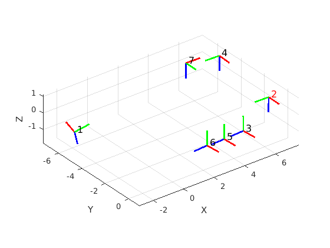
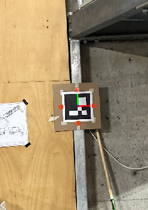
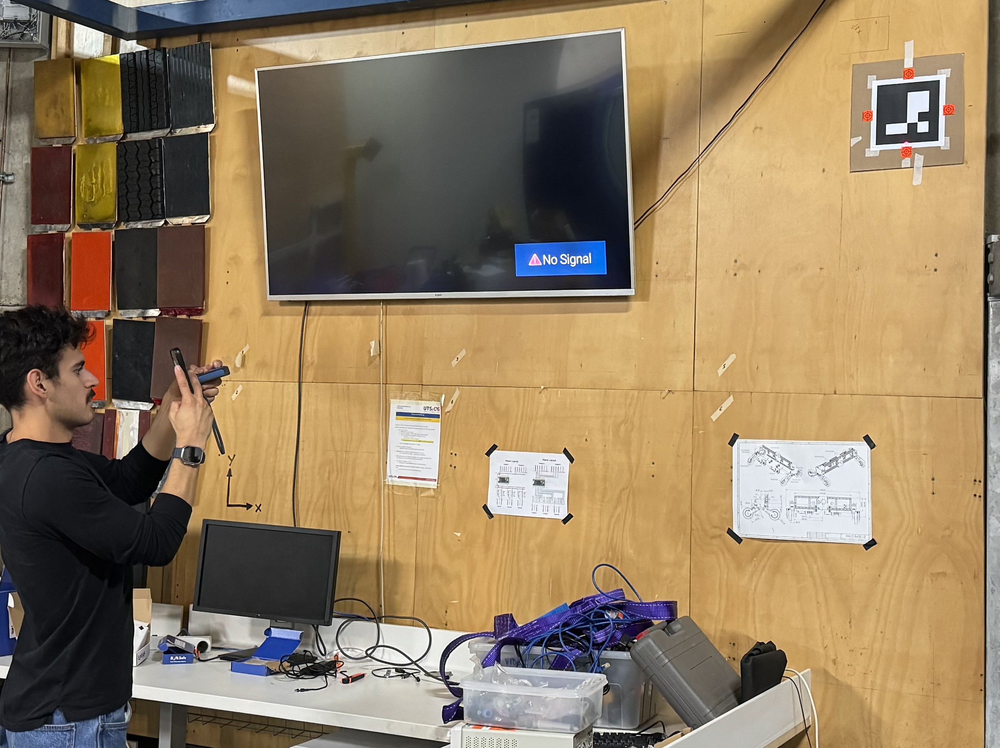
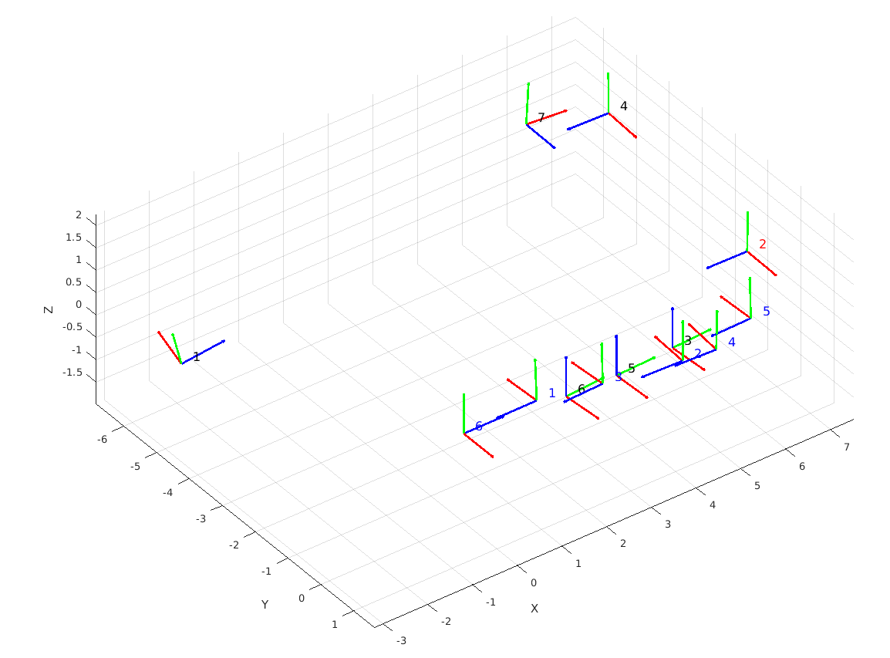

# AR_tags
The code below extracts the coordinates of various AR tags with four reflective targets around each marker using a theodolite station. The scans from the theodolite are saved into a CSV file, with each row representing one of the four corners of each marker. The last row represents the offset obtained from the theodolite, transforming each location into a local coordinate system with the station located at [0,0,0], as shown in the figure below:



## Localisation of bases using Theodolite
The location of each reflective target is determined using the theodolite, and an orientation is obtained as shown in the figure below:



Once all orientations and locations of the markers are obtained, main.m computes the transformation between each marker and a master marker. The bases can be determined using one or more CSV files from the theodolite. A master terminal must be selected and specified in line 14 of main.m:

```
master = 2;
```

To merge two files containing data from different scans, both files must contain the location of markers around the same base station. The base station number can be updated by changing lines 17 and 18 in main.m:

```
test_1_station = 2;
test_2_station = 1;
```

If the axes are incorrect between the two readings due to errors during the scan, the section below can be updated to adjust the axis of the second scan:

```
inv_x = 0;
inv_y = 1;
inv_z = 1;
```

## Localisation of bases using AR tags

After obtaining the location of all markers, the code in together.m determines the location of a person capturing an image of the marker. This allows for the localization of different people at different times on a map using only data obtained from images taken.



After capturing multiple pictures of the markers, the orientation and location of the markers are updated to match the coordinates obtained from the theodolite scans. If the locations do not match the image shown below using orientation_test.m, the lines below can be manually updated to align the correct axis:



```
pose.A = rotate_pose(pose.A, -90, 'x');
translationVector = [translationVector(3), translationVector(2), -translationVector(1)];
```

The marker number in each image is defined using the section below:
```
Marker_Image = [2, 4, 2, 4, 2, 4];
```

## TODO
- [ ] Update README
- [ ] Obtain offset in z axis
- [ ] Clean up code
- [ ] Create script for output data

## Cells that require tuning for correct axis 

108
112
125
139


